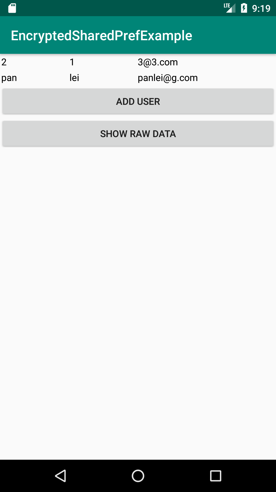
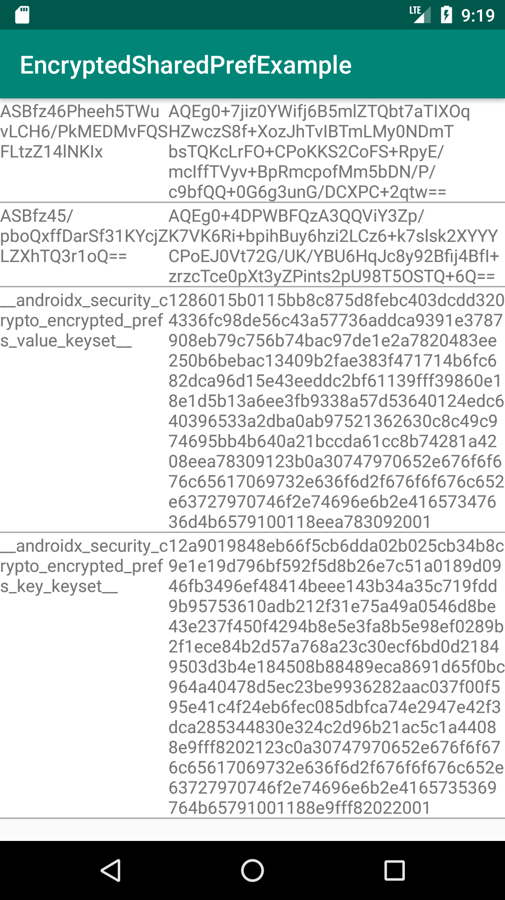

# A simple example of [EncryptedSharedPreferences](https://developer.android.com/reference/androidx/security/crypto/EncryptedSharedPreferences)

The [security-crypto](https://developer.android.com/reference/kotlin/androidx/security/crypto/package-summary) dependence available in Android x can help us to simplifier the encryptage of sensible data in SharedPreference.

This example allows us to create some users (with first name, last name and mail address) and save the user information encrypted via [EncryptedSharedPreferences](https://developer.android.com/reference/androidx/security/crypto/EncryptedSharedPreferences).

User list

encrpted_data
